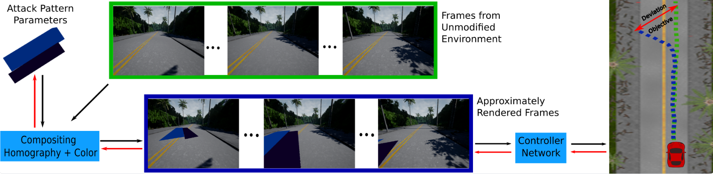

# Finding Physical Adversarial Examples for Autonomous Driving with Fast and Differentiable Image Compositing

[[arXiv]](http://arxiv.org/abs/2010.08844)   **paper**

We propose a scalable and efficient approach for finding adversarial physical modifications, using a differentiable approximation for the mapping from environmental modifications—namely, rectangles drawn on the road—to the corresponding video inputs to the controller network. Given the color, location, position, and orientation parameters of the rectangles, our mapping composites them onto pre-recorded video streams of the original environment. Our mapping accounts for geometric and color variations, is differentiable with respect to rectangle parameters, and uses multiple original video streams obtained by varying the driving trajectory. When combined with a neural network-based controller, our approach allows the design of adversarial modifications through end-to-end gradient-based optimization.

|<center>Conceptual Overview</center> | 
| :---: |
||

We evaluate our perturbations in Carla. (An open-source autonomous driving simulator.) Here are some evaluating examples of our attack. For these three examples, the autonomous vehicle aims to turn left, go straight and turn right, respectively. We can see that the perturbations may cause severe infractions.

|<center>Turn Left</center> | <center>Go Straight</center>|<center>Turn Right</center> |
| :---: | :---: | :---: |
| |  |  |


## Usage
1. Clone our repo
```
git clone https://github.com/jinghanY/physicalAttackImageComposition

```

2. Please read the *Carla Simulator* section of this documentation first. This section will help you go into detail about how to run the modified version of the Carla Simulator. 

3. We proposed GradOpt to learn the attack pattern, and use Bayesian Optimization based method proposed by [1] as the baseline. 

4. In *release*, you can find (1) layout: We have 40 scenarios in total. Please check the detailed information about the layout of scenarios in the dictionary ```IntersectionDictionary/adversary_name.json```. (2) datasets: you can find the data that you need for all 40 scenarios to composite the frames for our method. (If you want to learn these data by yourself, please don't skip the *calibration* section below.)

## Carla Simulator 
We modified the version of Carla Simulator that allows loading adversarial patterns from [1] [[code]](https://github.com/xz-group/AdverseDrive/). We will refer this modified version of Carla as Adversary-Env Carla before. We provide two options for running Adversary-Env Carla: package version and docker version.

### Installation and Run
#### Package version
1. Download the package version of Adversary-Env Carla from [AdversaryEnvCarla-v3](https://wustl.box.com/s/skj9kxn1zaroh7v33hv3jimy4wh4zjuq). Extract the contents of the directory and navigate to the extracted directory. 
```
tar xvzf carla-adversedriveV3.tar.gz
```
2. Under the directory of ```carlaAdvers_v3/```, start the Carla Simulator on a terminal
```
./start_carla.sh
```
This command starts the simulator on port 2000. 

#### docker version
Another option to run carla is to use the dockerized carla. The dockerized carla is portable, it contains the environment that you need to run carla. First, install docker if you haven't had it installed and then pull the latest modified version of the Adversary-Env Carla Simulator:
```
docker pull jinghan20/carla:v3
```
You can run the dockerized version of carla with:
```
./run_carla_docker.sh
```

### Load adversarial pattern
On a *new* terminal, navigate to the directory where you want to run the autonomous driving model. For example, in the calibration process, you need to navigate to the ```calibration/``` directory, and then you can start a python HTTP server. 
```
./start_server.sh
```
This command allows the Carla simulator to read the generated perturbation under ```adversary/``` and load it onto Carla. 
*Note: This requires port 8000 to be free.*

The above two steps start the Adversary-Env Carla Simulator and open the access of loading the generated perturbation onto Carla. After these two steps, you can move to the calibration step. 


## Get Adversarial Pattern
We refer to our approach as GradOpt.We used Bayesian Optimization (BO) as our baseline [1][4]. We aim to attack an end-to-end imitation learning model.[3]  

### Proposed Approach: GradOpt
GradOpt requires two steps for every scenario:(1) collecting a set of frame sequences and learning the spatial and color mappings, and (2) performing gradient-based optimization. 

Let's start with step one, the calibration step. 
#### Calibration
All code and dependence to get calibration information are under ```calibration/```. We provide an example scenario of getting the spatial and color mappings. The working directory of this section should be ```calibration/```. First, start a simulator with the two steps of starting Carla and loading adversarial patterns in the section of *Carla Simulator*.

##### Get spatial mappings. 
We model the spatial mapping for a scenario of a trajectory as a homography. We consider a small set of 4 representative trajectories: one from driving the car with the actual output control signals, and three from random noises added to these outputs. 

###### Clean trajectory
To get the sequence of homography matrice of the clean trajectories, run
```
  ./getCleanTraj.sh
```
###### Noise trajectories
To get three sequences of homography matrices of three noise trajectories, run
```
  ./getNoiseTraj.sh
```
##### Get color mapping
We learn a common set of color transform parameters for all frames in all trajectories, which we obtain by running the simulator 22 times. We use the 22 most contrasting color sets to determine the approximate linear relationship between the RGB colors of the painted figures, and their colors as visible in a frame. 

To get the color transformation matrix, run

```
  ./getColorMat.sh
```

#### Learning Adversarial Pattern
After getting the spatial and color mappings, we can learn the parameters of the perturbation via compositing frames. The working directory of this section is ```gradOpt/```.


*(Requirement: tensorflow version 1.13.1/1.15.0)*

##### Get the configuration files and running commands of the GradOpt jobs.  
First, run the scripts to create the configuration files and scripts that contain the running command of the GradOpt jobs. 
```
  ./run.sh 10 1 1
```
The three numbers are the numbers that we use to discretize the parameter space. 

Note that: After trying the example in the calibration, move the datasets in  ```datasets``` in release and put them, ```datasets_1, datasets_2, datasets_3, datasets_4```, under the ```calibration/```. You can either get your spatial and color mappings yourself or move to the next step with using our datasets. 

##### Start GradOpt jobs.
After running this bash script, you can find the running command for a scenario under ```Jobs_noParameter ```. (The *noParameter* is the number of parameters of the perturbation where we have 4, 7, 14, 21, 28, 35. You should also specify the task and scenario, *taskName* and *scenarioName* , of the jobs. )

```
  python3 imitation_fly_auto_continue/run.py -c config_noParameter/taskName/scenarioName/taskName-scenarioName-noParameter.json >> out_files/taskName/scenarioName/noParameter.txt
```
We have included an example to the ```Jobs_noParameter``` that you can play around. 

Note: if you want to run multiple jobs in parallel on a remote server, you may find that the average load (an index of the cpu usage) is a large number, and therefore running jobs slow down. This is because some packages we use would use multiple threads instead of 1, and it's unnecessary.  Therefore it's helpful to confine a job to certain machines. To solve this problem, we can add before the running command. ```taskset -c 0-1 ```
It's a "hard" version of "number of thread = 1". With 0-1, we pin the job to core 0 and 1, two cores, (you can increae the number of cores of running a job which depends on the number of resources.). Note that instead of assigning specific cores manually with ```0-1```, there would be an automatical way to find the cpu ids that the job assigned to. The command depends on what scheduler platform you are using. 

### Baseline: BO
BO requires the simulator in the training process. The working directory of this section is ```AdverseDrive/```. Here we add details about how to run up to 8 BO jobs in parallel. Note that each job requires a simulator. You can run at most 8 BO jobs in parallel due to the setup of the Adversary-Env Carla, since there are at most 8 different adversarial pattern loading accesses.)  For more details about how does BO work, please refer to [1] [[code]](https://github.com/xz-group/AdverseDrive/). 

#### Start simulators
```
  ./run_carla_cluster.sh
```

#### loading adversarial patterns
```
  ./start_server.sh
```

#### training with BO
```
  ./run_experiment_cluster.sh
```


## References
1. Attacking Vision-based Perception in End-to-End Autonomous Driving Models: [https://arxiv.org/pdf/1910.01907.pdf](https://arxiv.org/pdf/1910.01907.pdf)
2. Carla Simulator: [https://github.com/carla-simulator/carla](https://github.com/carla-simulator/carla)
3. Imitation Learning: [https://github.com/carla-simulator/imitation-learning](https://github.com/carla-simulator/imitation-learning)
4. Bayesian Optimization: [https://github.com/fmfn/BayesianOptimization](https://github.com/fmfn/BayesianOptimization)


Contact [jinghan.yang@wustl.edu]() with any questions.

